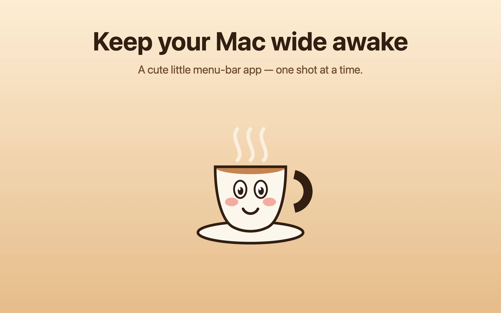
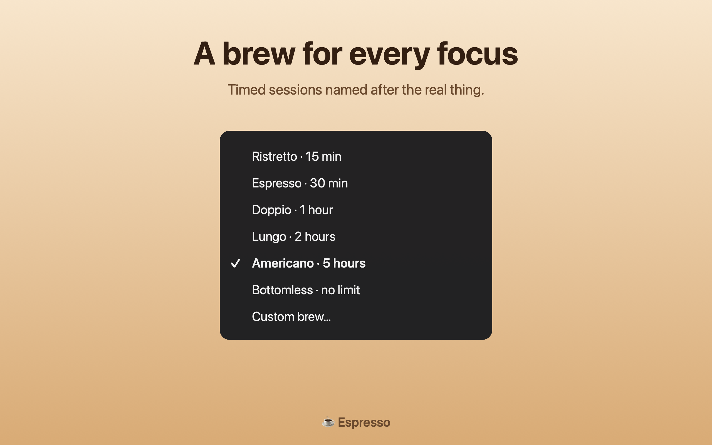
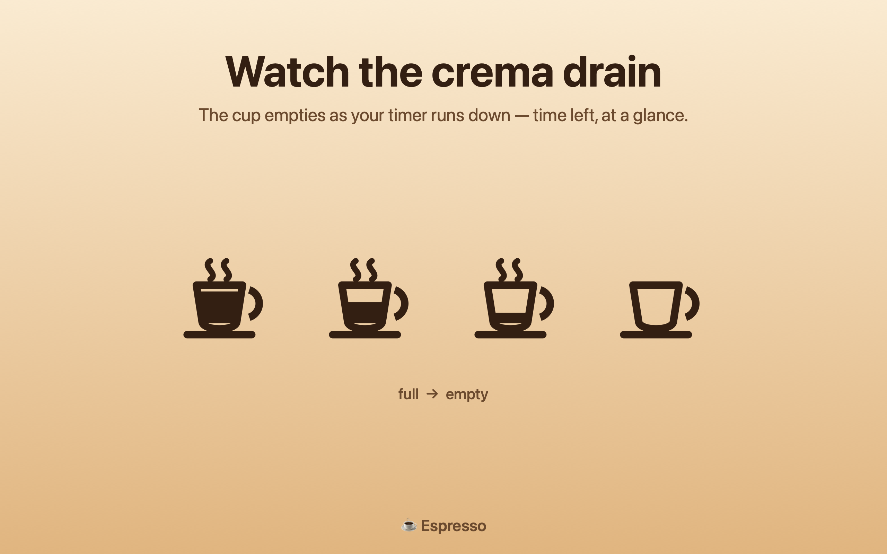
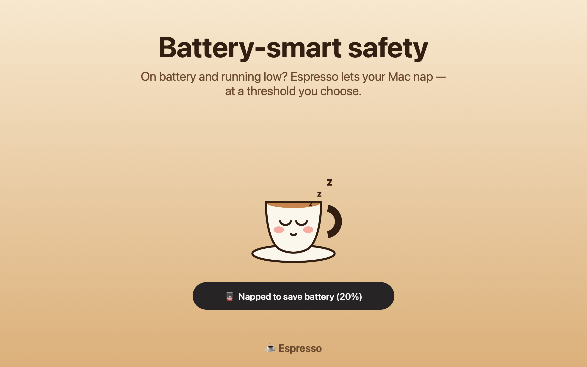
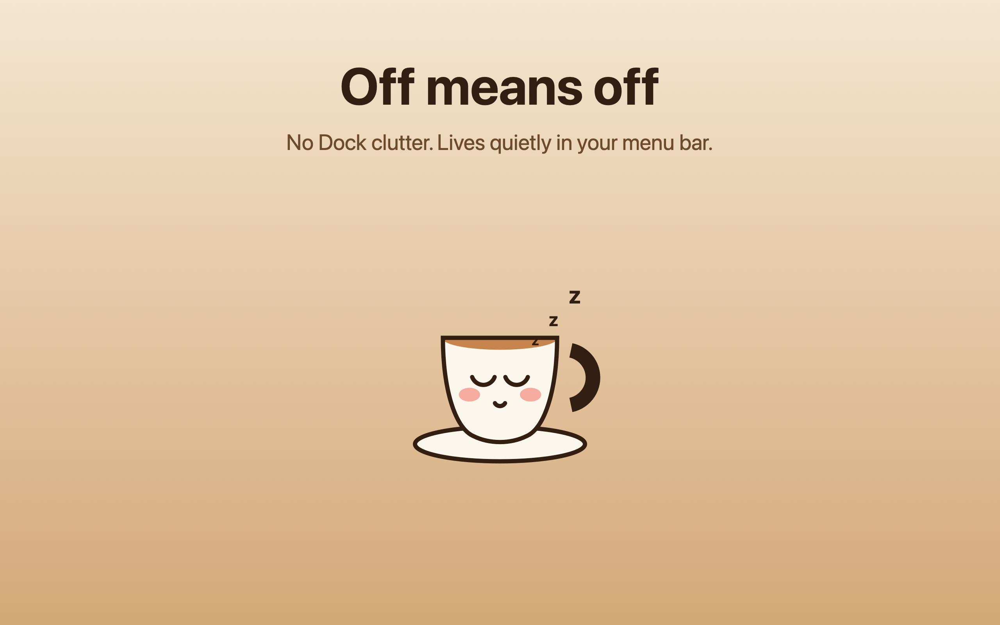

<p align="center">
  
</p>

<h1 align="center">Espresso ☕</h1>

<p align="center">
  A tiny, native <b>menu-bar app for Apple Silicon Macs</b> that keeps your Mac awake —
  indefinitely or for a timed “brew” — with an espresso cup whose crema <b>drains</b> as the timer runs down.
</p>

<p align="center">
  <a href="https://github.com/sirisaaccalvo-gif/Espresso/actions/workflows/ci.yml"></a>
  
  
  
</p>

<p align="center"><sub>by <a href="https://isaaccalvo.com"><b>Isaac Calvo</b></a> · <a href="https://isaaccalvo.com">isaaccalvo.com</a></sub></p>

> **Why isn't this on the App Store?** The keep-awake category is saturated with excellent
> *free* apps (Amphetamine, Jolt of Caffeine, Owly, …), so there's no reason to charge for it.
> Espresso is **free and open source** — build it from source below.

## Features
- Keep awake **indefinitely** or for a **timed brew** — coffee-named presets
  (Ristretto · 15m, Espresso · 30m, Doppio · 1h, Lungo · 2h, Americano · 5h, Bottomless) plus a
  custom hours+minutes dial.
- Live **countdown** in the menu bar; the espresso cup **drains** as time runs out.
- Optional **keep the display awake too** (otherwise only the system stays awake).
- **Survives a closed lid:** while plugged in, closing the lid keeps your Mac awake with the
  screen off — enable *“Prevent automatic sleeping when the display is off”* in
  System Settings ▸ Displays. (On battery, closing the lid still sleeps to save power.)
- **Battery safety:** automatically lets your Mac nap when on battery and the charge hits a
  chosen threshold (default 20%) — a forgotten session can't drain you flat.
- **Launch at login.**
- A cute cup **mascot** app icon (awake / napping). Menu-bar only — no Dock icon.

## Screenshots
| | |
|---|---|
|  |  |
|  |  |

## How it works
Uses IOKit **power assertions** (`IOPMAssertionCreateWithName`) — the same mechanism as macOS's
built-in `caffeinate`. `PreventUserIdleSystemSleep` keeps the system awake while letting the
display sleep; `PreventUserIdleDisplaySleep` is added when “keep display awake” is on.
`PreventSystemSleep` is also held so closing the lid doesn't sleep the Mac — this takes effect on
AC power once *“Prevent automatic sleeping when the display is off”* is enabled in
System Settings ▸ Displays (it's a no-op on battery).
Assertions are always released on quit. Launch-at-login uses `SMAppService` (macOS 13+).

## Build & run
Requires macOS 13+ and a Swift toolchain (Xcode or Command Line Tools).
```sh
git clone https://github.com/sirisaaccalvo-gif/Espresso.git
cd Espresso
scripts/build_app.sh          # produces Espresso.app (ad-hoc signed)
open Espresso.app             # launches into the menu bar
```
> It's ad-hoc signed (not notarized), so on first launch right-click the app → **Open** to get
> past Gatekeeper. A notarized release could be added later.

## Run the tests
```sh
swift run EspressoTests       # dependency-free runner; exits non-zero on failure
```
XCTest/Swift-Testing require full Xcode, so the suite is a small executable target that imports
`EspressoKit` — covering time formatting, the battery-nap decision, duration parsing, and the
IOKit assertion lifecycle. Every push runs `swift build` + these tests via GitHub Actions.

## Project layout
```
Package.swift                 swift-tools 5.9, macOS 13+; 3 targets
Sources/EspressoKit/          pure, testable logic (no AppKit)
  TimeFormatting · BatteryGuard · BatteryOrchestrator · DurationLogic · KeepAwakeController
Sources/Espresso/             the menu-bar app (depends on EspressoKit)
  EspressoMain · AppDelegate · SessionTimer · CupIconRenderer · MascotRenderer
  ScreenshotRenderer · DurationPopover · Settings · LaunchAtLogin · SelfTest
Tests/EspressoTests/          dependency-free test runner
scripts/build_app.sh          builds + bundles Espresso.app
AppStore/                     listing copy + generated screenshots (reference)
```
Dev-only CLI helpers (`--selftest`, `--make-icon`, `--make-screenshots`, …) compile **only in
debug** (gated behind `ESPRESSO_DEVTOOLS`) and are excluded from release builds.

## What this project demonstrates
A small but complete native-macOS engineering sample:
- **AppKit menu-bar app** on Apple Silicon — `NSStatusItem`/`NSMenu`/`NSPopover`, IOKit power
  assertions, `SMAppService` launch-at-login.
- **Clean architecture** — UI/logic split into a testable `EspressoKit` library.
- **Quality gates** — unit tests + GitHub Actions CI, two adversarial code-review passes,
  release builds stripped of dev tooling.
- **Design from code** — the cup glyph, the mascot app icon, and the App Store-grade
  screenshots are all drawn procedurally (resolution-independent, regenerable via one command).

## License
[MIT](LICENSE) © 2026 [Isaac Calvo](https://isaaccalvo.com)
